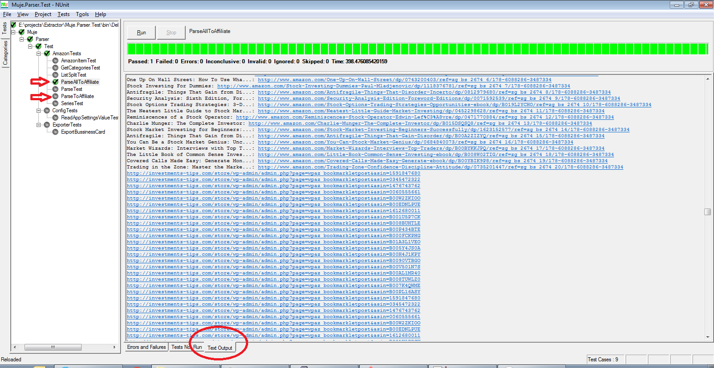

# Export Directory
An exporter directory parser. Parse company registration information to a more readable format for further data manipulation.

## Export Malaysia Company Data
This is a console to parse output from http://edirectory.matrade.gov.my/application/edirectory.nsf/PrintCompany?OpenAgent&Option=detail&param=3100+3101+3102+3103+3104+3105.

see http://edirectory.matrade.gov.my/application/edirectory.nsf

## How To Use
    Open a console > ExtractBusinessCard.exe start end

where start and end is an integer ie. 3100. The result is save at the same location with file name _output.csv_ after finish.

# Extract Url from Amazon
The base url contains 10 categories and each url contains 100 books. See attached text file for according category result. Totally we extracted 1100 links for the amazonaire affiliate bookmarklet to use.

- Business  Money Investing
- Analysis & Strategy
- Bonds
- Commodities
- Futures
- Introduction
- Mutual Funds
- Online Trading
- Options
- Real Estate
- Stocks

## How To
1. Download 4 files from https://github.com/yancyn/ > extractor > release > v1.6.1.10 (assemblies only not source code) to your computer.
2. Install latest NUnit runner.
3. File > Open Project > Muje.Parser.Test.dll
4. Chose ParseToAffiliate or ParseAllToAffiliate > Run.
5. Done.

* you can modify the AmazonBaseUrl value to parse different amazon search page result in Muje.Parser.Test.dll.config.

